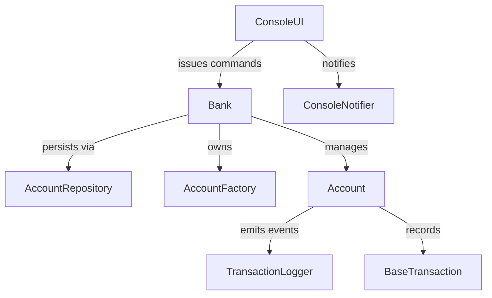

# Banking System

A modular Java banking platform that simulates common retail banking flows such as onboarding customers, managing multi-type accounts, and executing money-movement operations with audit trails. The system prioritizes correctness, extensibility, and an operator-friendly console experience.

## Documentation Hub
- Browse the curated knowledge base in the [project wiki](wiki/Home.md) for quick-start guides, architecture summaries, operations runbooks, and troubleshooting tips.
- Detailed reference material continues to live under the [`docs/`](docs) directory for deep dives into specific subsystems.

## Product Summary
- **Customers & Accounts:** Create Savings, Current, and Fixed Deposit accounts with configurable rules, interest accrual, and account lifecycle management.
- **Transaction Processing:** Queue-backed execution of deposits, withdrawals, transfers, and interest postings with transaction history retention.
- **Operator Console:** Guided CLI backed by `ConsoleUI` for everyday teller workflows, including quick search and reporting utilities.
- **HTTP API:** `ApiApplication` wraps the domain layer in a hardened HTTP adapter that exposes health, metrics, account discovery, account maintenance, and transaction queuing endpoints suitable for automation and integration tests.
- **Observability:** Observer pattern connects `ConsoleNotifier` and `TransactionLogger` to important account events for traceability.
- **Persistence & Caching:** `AccountRepository` pluggably stores serialized account aggregates. The default in-memory repository is ideal for demos, while the JDBC implementation targets relational databases with migration support. `CacheProvider` instances sit in front of the repository to accelerate hot-path reads and can be swapped or disabled via configuration.

## Architecture Overview
The application uses a layered design built around the `Bank` aggregate:
- **Presentation:** `ConsoleUI` orchestrates user interactions and translates console actions into domain commands.
- **Domain & Services:** `Bank`, `Account` hierarchy, and concrete `AccountOperation` implementations encapsulate business rules and concurrency controls.
- **Infrastructure:** `AccountRepository` (with `JdbcAccountRepository` and `InMemoryAccountRepository`) provides durable storage. `MigrationRunner` applies SQL migrations during startup, and the asynchronous executor coordinates background processing.

Detailed designs and diagrams are available in the [System Design](docs/architecture-system-design.md) and [Low-Level Architecture](docs/architecture-low-level.md) guides. The high-level component relationships are shown below.



## Caching Configuration
- **Providers:** `CacheProviderFactory` selects an implementation based on `CACHE_PROVIDER` (or JVM property `banking.cache.provider`). The default `memory` option enables the in-process `InMemoryCacheProvider`, while `none` switches to the no-op adapter for troubleshooting or environments that prefer cold reads.
- **Scope:** The `Bank` service uses caches for full `Account` snapshots and derived balances, warming them on startup and keeping entries coherent after every successful mutation.
- **TTLs:** Entries expire after five minutes unless overridden with `CACHE_TTL_SECONDS`. Specify per-cache TTLs with `CACHE_ACCOUNT_TTL_SECONDS` and `CACHE_BALANCE_TTL_SECONDS`. Setting a TTL to zero or a negative value disables expiration for that cache.

## Operations Runbooks

> Need a step-by-step workstation guide? Follow the [Windows 11 setup instructions](docs/setup-windows.md) for tooling installation, environment variables, and local bootstrap commands.
### Provision & Boot
1. Install JDK 17 and clone the repository.
2. Compile the sources from the project root:
   ```bash
   mkdir -p build/classes
   find src -name '*.java' > sources.txt
   javac -d build/classes @sources.txt
   ```
3. Export the database connection (replace the credentials/host with your environment):
 ```bash
  export BANKING_STORAGE_MODE=jdbc
  export BANKING_JDBC_URL="jdbc:mysql://localhost:3306/banking?useSSL=true&requireSSL=false&serverTimezone=UTC"
  export BANKING_DB_USER="bank_user"
  export BANKING_DB_PASSWORD="ChangeMe123!"
  # Optional cache tuning
  export CACHE_PROVIDER=memory         # or "none" to disable caching entirely
  export CACHE_TTL_SECONDS=600         # override per-cache TTL with CACHE_ACCOUNT_TTL_SECONDS / CACHE_BALANCE_TTL_SECONDS
  ```
4. Run database migrations:
   ```bash
   bash deploy/scripts/run-migrations.sh
   ```
5. Launch the console application:
   ```bash
   java -cp build/classes banking.BankingApplication
   ```
6. Confirm the startup banner and ensure accounts persist across restarts by relaunching the console or API.

### HTTP API Smoke Test
1. Ensure the classes are compiled and the environment variables from the previous section are still exported.
2. Start the API server:
   ```bash
   java -cp build/classes banking.api.ApiApplication
   ```
3. In a separate terminal, request an operator token and exercise the API (replace `<ACCOUNT_NUMBER>` with the value returned by the creation call). Every request **must** include the bearer token header:
   ```bash
   TOKEN=$(curl -s -X POST "http://localhost:8080/auth/login" -d "username=admin&password=admin123!" | jq -r .token)
   curl -H "Authorization: Bearer $TOKEN" -X POST "http://localhost:8080/accounts" -d "name=Grace&type=savings&deposit=1000"
   curl -H "Authorization: Bearer $TOKEN" "http://localhost:8080/accounts"
   curl -H "Authorization: Bearer $TOKEN" "http://localhost:8080/accounts/<ACCOUNT_NUMBER>"
   curl -H "Authorization: Bearer $TOKEN" -X PUT "http://localhost:8080/accounts/<ACCOUNT_NUMBER>" -d "userName=Grace%20Hopper"
   curl -H "Authorization: Bearer $TOKEN" -X DELETE "http://localhost:8080/accounts/<ACCOUNT_NUMBER>"
   ```
4. Inspect `/metrics` with the bearer token header to verify uptime, account counts, and queue depth telemetry:
   ```bash
   curl -H "Authorization: Bearer $TOKEN" "http://localhost:8080/metrics"
   ```
5. Stop the process with `Ctrl+C`; graceful shutdown ensures all in-flight operations complete and state is flushed via `BankDAO.saveBank`.


### Data Backup & Restore
- **Backup:** Schedule nightly logical dumps (`mysqldump banking > banking-$(date +%F).sql`) or point-in-time backups from your managed MySQL service. Optionally archive `banking_state.properties` when running in snapshot mode for local experiments.
- **Restore:** Apply database dumps to a recovery environment and point the application’s `BANKING_JDBC_URL` to the restored cluster. Legacy serialized `.ser` files are automatically converted into snapshots on first boot and subsequently migrated into MySQL.
- **Reset:** Drop and recreate the schema for a clean slate (`DROP DATABASE banking; CREATE DATABASE banking;`).

### Troubleshooting
- **Database Connectivity:** Validate `BANKING_JDBC_URL`, username, and password. `mysql -h <host> -u <user> -p` should succeed from the host where the API runs.
- **Schema Drift:** Re-run `bash deploy/scripts/run-migrations.sh` after promoting new releases so the schema version matches the application expectations.
- **Authentication Errors:** Ensure every HTTP request includes the `Authorization: Bearer <token>` header. Issue a new token from the console or `/auth/login` endpoint if the current token expires.
- **Snapshot Mode Testing:** When experimenting with the filesystem repository locally, unset `BANKING_STORAGE_MODE` and ensure `BANKING_DATA_PATH` points to a writable location.

### Container & Infrastructure Automation
- **Docker Compose:** `docker compose -f deploy/compose/docker-compose.yml up` builds the console/API images and provisions a local MySQL container wired with matching environment variables for parity with staging. Tear down with `docker compose ... down` when finished.
- **Terraform Deployments:** Export `TF_VAR_db_password` (or inject via your secrets manager) before applying `deploy/terraform/environments/<env>.tfvars`. The module creates Kubernetes secrets, deployments, and autoscaling policies that expect a managed MySQL endpoint defined by `jdbc_url`.

## Roadmap
1. **Observability Enhancements:** Ship structured logs to a centralized aggregator and publish RED metrics for key flows.
2. **Security Hardening:** Layer on mTLS between services, add request signing for console automations, and integrate with an identity provider for operator authentication.
3. **Domain Testing:** Expand the automated test suite with property-based tests and golden-file regression checks for reporting outputs.
4. **Performance:** Introduce connection pooling and bulk operation APIs for batched ingest workloads.
5. **Disaster Recovery Drills:** Automate failover simulations across regions and document recovery point objectives empirically.
1. Install JDK 11+ and clone the repository.
2. Compile from the project root: `javac $(find src/main/java -name "*.java")`.
3. Start the console application: `java -cp src/main/java banking.BankingApplication`.
4. By default the in-memory repository is used. To exercise the JDBC path, set environment variables such as `BANKING_PERSISTENCE=jdbc` and `BANKING_JDBC_URL=jdbc:h2:mem:bank;DB_CLOSE_DELAY=-1` before launching.
5. When you are done for the day, exit through menu option **7** so outstanding asynchronous operations flush and the repository closes cleanly.


### Data Backup & Restore
- **Backup:** For JDBC deployments, follow your database's backup tooling (e.g., `pg_dump`, `mysqldump`, H2 file copy). For in-memory demos, no backup is required.
- **Restore:** Restore the relational database snapshot before launching. The migration runner will detect existing schema versions and skip reapplied scripts.
- **Reset:** Drop the `accounts` table (or use a new JDBC URL) to clear persisted data. The in-memory repository always starts empty.

### Troubleshooting
- **Database Connectivity:** Verify JDBC URLs, credentials, and drivers (`BANKING_JDBC_DRIVER`) when the application cannot connect during startup.
- **Stalled Operations:** Ensure the executor thread pool is not exhausted; restart the app to reinitialize the queue.
- **Invalid Inputs:** Watch console prompts—validation errors indicate the value that needs correction.

## Roadmap
1. **API Gateway:** Expose REST endpoints with Spring Boot for web/mobile clients.
2. **Observability Enhancements:** Wire the repository to metrics/logging to monitor query latency and failure rates.
3. **Authentication:** Add role-based access control with audit logging.
4. **Reporting Suite:** Generate configurable statements and regulatory reports.
5. **CI/CD Automation:** Introduce automated builds, tests, and packaging pipelines.

## Contributing & Governance
Community guidelines live in [CONTRIBUTING.md](CONTRIBUTING.md) and [CODE_OF_CONDUCT.md](CODE_OF_CONDUCT.md). Start there before submitting issues or pull requests.
