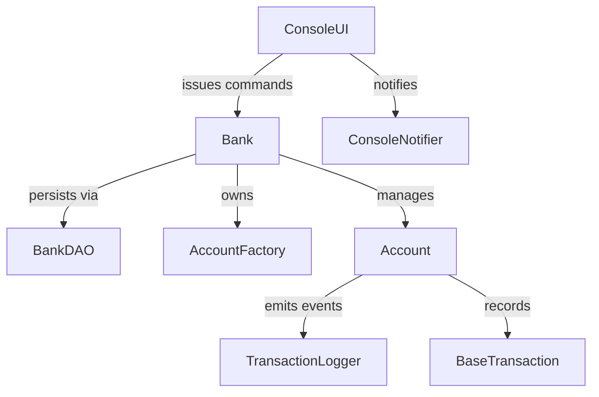

# Banking System

A modular Java banking platform that simulates common retail banking flows such as onboarding customers, managing multi-type accounts, and executing money-movement operations with audit trails. The system prioritizes correctness, extensibility, and an operator-friendly console experience.

## Product Summary
- **Customers & Accounts:** Create Savings, Current, and Fixed Deposit accounts with configurable rules, interest accrual, and account lifecycle management.
- **Transaction Processing:** Queue-backed execution of deposits, withdrawals, transfers, and interest postings with transaction history retention.
- **Operator Console:** Guided CLI backed by `ConsoleUI` for everyday teller workflows, including quick search and reporting utilities.
- **HTTP Gateway:** Optional REST-style facade powered by `BankHttpServer` for integrations that need lightweight programmatic access.
- **Statement Reporting:** Generate dated account statements with opening/closing balance summaries from the reports menu.
- **Observability:** Observer pattern connects `ConsoleNotifier` and `TransactionLogger` to important account events for traceability.
- **Persistence:** `BankDAO` serializes the in-memory `Bank` aggregate to disk for fast start-up and recovery.

## Architecture Overview
The application uses a layered design built around the `Bank` aggregate:
- **Presentation:** `ConsoleUI` orchestrates user interactions and translates console actions into domain commands.
- **Domain & Services:** `Bank`, `Account` hierarchy, and concrete `AccountOperation` implementations encapsulate business rules and concurrency controls.
- **Infrastructure:** `BankDAO` handles serialization, while the asynchronous executor coordinates background processing.

Detailed designs and diagrams are available in the [System Design](docs/architecture-system-design.md) and [Low-Level Architecture](docs/architecture-low-level.md) guides. The high-level component relationships are shown below.

## Operations Runbooks
### Provision & Boot
1. Install JDK 8+ and clone the repository.
2. Compile from the project root: `javac $(find src -name "*.java")`.
3. Run the lightweight regression suite: `java -cp src banking.test.BankTestRunner`.
4. Start the console application: `java -cp src banking.BankingApplication`.
   - Add `--api` to the command (e.g., `java -cp src banking.BankingApplication --api`) to launch the HTTP gateway alongside the console on port **8080**.
5. Confirm the startup banner and ensure `banking_system.ser` loads existing state.
6. When you are done for the day, exit through menu option **7** so `BankDAO.saveBank` writes the latest snapshot.

### Data Backup & Restore
- **Backup:** Copy the `banking_system.ser` artifact to secure storage after closing the app.
- **Restore:** Place the backup in the project root before launching. The `BankDAO` loader hydrates the bank state automatically on boot.
- **Reset:** Delete `banking_system.ser` for a clean slate; the application recreates it on exit.

### Troubleshooting
- **Serialization Errors:** Remove corrupted `banking_system.ser` and restart to rebuild from scratch.
- **Stalled Operations:** Ensure the executor thread pool is not exhausted; restart the app to reinitialize the queue.
- **Invalid Inputs:** Watch console prompts—validation errors indicate the value that needs correction.

### HTTP Gateway Quickstart
- **Health Check:** `curl http://localhost:8080/health`
- **List Accounts:** `curl http://localhost:8080/accounts`
- **Create Account:** `curl -X POST "http://localhost:8080/accounts?name=Alex&type=savings&deposit=250"`
- **Deposit Funds:** `curl -X POST "http://localhost:8080/operations/deposit?accountNumber=123456&amount=100"`
- **Transfer Funds:** `curl -X POST "http://localhost:8080/operations/transfer?sourceAccount=123456&targetAccount=654321&amount=50"`

All parameters use `application/x-www-form-urlencoded` encoding; include them in either the query string or POST body.

## Roadmap
1. **API Gateway Evolution:** Graduate the lightweight HTTP facade to a Spring Boot service with authentication, validation, and observability.
2. **Database Layer:** Replace flat-file serialization with a relational persistence layer and migration tooling.
3. **Authentication:** Add role-based access control with audit logging.
4. **Reporting Suite:** Generate configurable statements and regulatory reports.
5. **CI/CD Automation:** Introduce automated builds, tests, and packaging pipelines.

## Contributing & Governance
Community guidelines live in [CONTRIBUTING.md](CONTRIBUTING.md) and [CODE_OF_CONDUCT.md](CODE_OF_CONDUCT.md). Start there before submitting issues or pull requests.
