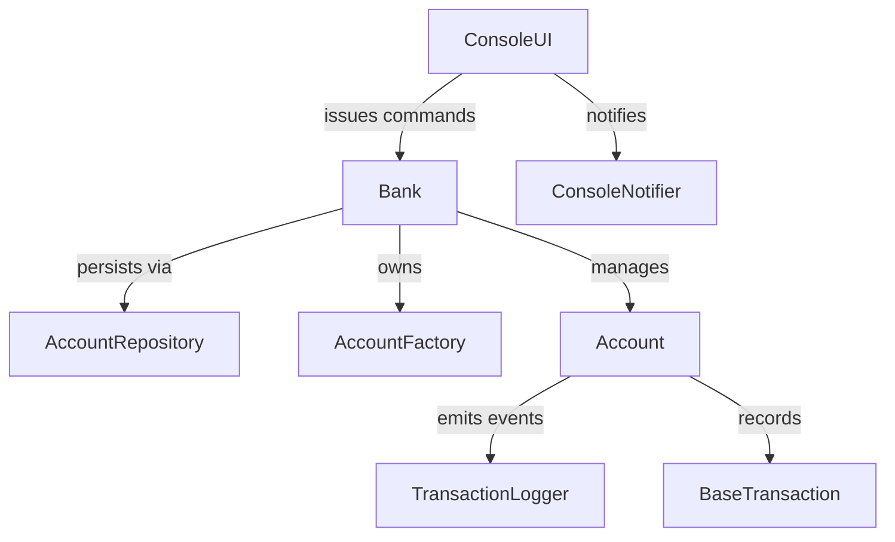

# Banking System

A modular Java banking platform that simulates common retail banking flows such as onboarding customers, managing multi-type accounts, and executing money-movement operations with audit trails. The system prioritizes correctness, extensibility, and an operator-friendly console experience.

## Product Summary
- **Customers & Accounts:** Create Savings, Current, and Fixed Deposit accounts with configurable rules, interest accrual, and account lifecycle management.
- **Transaction Processing:** Queue-backed execution of deposits, withdrawals, transfers, and interest postings with transaction history retention.
- **Operator Console:** Guided CLI backed by `ConsoleUI` for everyday teller workflows, including quick search and reporting utilities.
- **Observability:** Observer pattern connects `ConsoleNotifier` and `TransactionLogger` to important account events for traceability.
- **Persistence:** `AccountRepository` pluggably stores serialized account aggregates. The default in-memory repository is ideal for demos, while the JDBC implementation targets relational databases with migration support.

## Architecture Overview
The application uses a layered design built around the `Bank` aggregate:
- **Presentation:** `ConsoleUI` orchestrates user interactions and translates console actions into domain commands.
- **Domain & Services:** `Bank`, `Account` hierarchy, and concrete `AccountOperation` implementations encapsulate business rules and concurrency controls.
- **Infrastructure:** `AccountRepository` (with `JdbcAccountRepository` and `InMemoryAccountRepository`) provides durable storage. `MigrationRunner` applies SQL migrations during startup, and the asynchronous executor coordinates background processing.

Detailed designs and diagrams are available in the [System Design](docs/architecture-system-design.md) and [Low-Level Architecture](docs/architecture-low-level.md) guides. The high-level component relationships are shown below.

## Operations Runbooks
### Provision & Boot
1. Install JDK 11+ and clone the repository.
2. Compile from the project root: `javac $(find src/main/java -name "*.java")`.
3. Start the console application: `java -cp src/main/java banking.BankingApplication`.
4. By default the in-memory repository is used. To exercise the JDBC path, set environment variables such as `BANKING_PERSISTENCE=jdbc` and `BANKING_JDBC_URL=jdbc:h2:mem:bank;DB_CLOSE_DELAY=-1` before launching.
5. When you are done for the day, exit through menu option **7** so outstanding asynchronous operations flush and the repository closes cleanly.

### Data Backup & Restore
- **Backup:** For JDBC deployments, follow your database's backup tooling (e.g., `pg_dump`, `mysqldump`, H2 file copy). For in-memory demos, no backup is required.
- **Restore:** Restore the relational database snapshot before launching. The migration runner will detect existing schema versions and skip reapplied scripts.
- **Reset:** Drop the `accounts` table (or use a new JDBC URL) to clear persisted data. The in-memory repository always starts empty.

### Troubleshooting
- **Database Connectivity:** Verify JDBC URLs, credentials, and drivers (`BANKING_JDBC_DRIVER`) when the application cannot connect during startup.
- **Stalled Operations:** Ensure the executor thread pool is not exhausted; restart the app to reinitialize the queue.
- **Invalid Inputs:** Watch console prompts—validation errors indicate the value that needs correction.

## Roadmap
1. **API Gateway:** Expose REST endpoints with Spring Boot for web/mobile clients.
2. **Observability Enhancements:** Wire the repository to metrics/logging to monitor query latency and failure rates.
3. **Authentication:** Add role-based access control with audit logging.
4. **Reporting Suite:** Generate configurable statements and regulatory reports.
5. **CI/CD Automation:** Introduce automated builds, tests, and packaging pipelines.

## Contributing & Governance
Community guidelines live in [CONTRIBUTING.md](CONTRIBUTING.md) and [CODE_OF_CONDUCT.md](CODE_OF_CONDUCT.md). Start there before submitting issues or pull requests.
