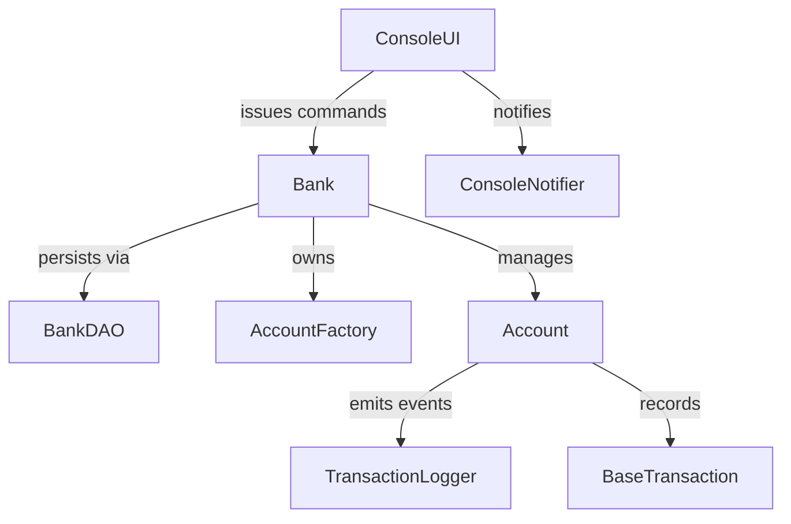

# Banking System

A modular Java banking platform that simulates common retail banking flows such as onboarding customers, managing multi-type accounts, and executing money-movement operations with audit trails. The system prioritizes correctness, extensibility, and an operator-friendly console experience.

## Product Summary
- **Customers & Accounts:** Create Savings, Current, and Fixed Deposit accounts with configurable rules, interest accrual, and account lifecycle management.
- **Transaction Processing:** Queue-backed execution of deposits, withdrawals, transfers, and interest postings with transaction history retention.
- **Operator Console:** Guided CLI backed by `ConsoleUI` for everyday teller workflows, including quick search and reporting utilities.
- **HTTP API:** `ApiApplication` wraps the domain layer in a hardened HTTP adapter that exposes health, metrics, account discovery, account maintenance, and transaction queuing endpoints suitable for automation and integration tests.
- **Observability:** Observer pattern connects `ConsoleNotifier` and `TransactionLogger` to important account events for traceability.
- **Persistence:** `BankDAO` now persists the in-memory `Bank` aggregate through a pluggable repository. Production deployments stream state into a MySQL schema managed by automated migrations while local development can still fall back to the snapshot file store.

## Architecture Overview
The application uses a layered design built around the `Bank` aggregate:
- **Presentation:** `ConsoleUI` orchestrates user interactions and translates console actions into domain commands.
- **Domain & Services:** `Bank`, `Account` hierarchy, and concrete `AccountOperation` implementations encapsulate business rules and concurrency controls.
- **Infrastructure:** `BankRepositoryFactory` selects a JDBC-backed repository (with migration orchestration and connection management) or the legacy snapshot adapter based on environment configuration, while the asynchronous executor coordinates background processing.

Detailed designs and diagrams are available in the [System Design](docs/architecture-system-design.md) and [Low-Level Architecture](docs/architecture-low-level.md) guides. The high-level component relationships are shown below.



## Operations Runbooks

> Need a step-by-step workstation guide? Follow the [Windows 11 setup instructions](docs/setup-windows.md) for tooling installation, environment variables, and local bootstrap commands.
### Provision & Boot
1. Install JDK 17 and clone the repository.
2. Compile the sources from the project root:
   ```bash
   mkdir -p build/classes
   find src -name '*.java' > sources.txt
   javac -d build/classes @sources.txt
   ```
3. Export the database connection (replace the credentials/host with your environment) and API key:
   ```bash
   export BANKING_STORAGE_MODE=jdbc
   export BANKING_JDBC_URL="jdbc:mysql://localhost:3306/banking?useSSL=true&requireSSL=false&serverTimezone=UTC"
   export BANKING_DB_USER="bank_user"
   export BANKING_DB_PASSWORD="ChangeMe123!"
   export BANKING_API_KEY="local-dev-key"
   ```
4. Run database migrations:
   ```bash
   bash deploy/scripts/run-migrations.sh
   ```
5. Launch the console application:
   ```bash
   java -cp build/classes banking.BankingApplication
   ```
6. Confirm the startup banner and ensure accounts persist across restarts by relaunching the console or API.

### HTTP API Smoke Test
1. Ensure the classes are compiled and the environment variables from the previous section are still exported.
2. Start the API server:
   ```bash
   java -cp build/classes banking.api.ApiApplication
   ```
3. In a separate terminal, create and manage accounts via `curl` (replace `<ACCOUNT_NUMBER>` with the identifier returned by the creation call). Every request **must** include the API key header:
   ```bash
   curl -H "X-API-Key: $BANKING_API_KEY" -X POST "http://localhost:8080/accounts" -d "userName=Grace&accountType=savings&initialDeposit=1000"
   curl -H "X-API-Key: $BANKING_API_KEY" "http://localhost:8080/accounts"
   curl -H "X-API-Key: $BANKING_API_KEY" "http://localhost:8080/accounts/<ACCOUNT_NUMBER>"
   curl -H "X-API-Key: $BANKING_API_KEY" -X PUT "http://localhost:8080/accounts/<ACCOUNT_NUMBER>" -d "userName=Grace%20Hopper"
   curl -H "X-API-Key: $BANKING_API_KEY" -X DELETE "http://localhost:8080/accounts/<ACCOUNT_NUMBER>"
   ```
4. Inspect `/metrics` with the API key header to verify uptime, account counts, and queue depth telemetry:
   ```bash
   curl -H "X-API-Key: $BANKING_API_KEY" "http://localhost:8080/metrics"
   ```
5. Stop the process with `Ctrl+C`; graceful shutdown ensures all in-flight operations complete and state is flushed via `BankDAO.saveBank`.


### Data Backup & Restore
- **Backup:** Schedule nightly logical dumps (`mysqldump banking > banking-$(date +%F).sql`) or point-in-time backups from your managed MySQL service. Optionally archive `banking_state.properties` when running in snapshot mode for local experiments.
- **Restore:** Apply database dumps to a recovery environment and point the application’s `BANKING_JDBC_URL` to the restored cluster. Legacy serialized `.ser` files are automatically converted into snapshots on first boot and subsequently migrated into MySQL.
- **Reset:** Drop and recreate the schema for a clean slate (`DROP DATABASE banking; CREATE DATABASE banking;`).

### Troubleshooting
- **Database Connectivity:** Validate `BANKING_JDBC_URL`, username, and password. `mysql -h <host> -u <user> -p` should succeed from the host where the API runs.
- **Schema Drift:** Re-run `bash deploy/scripts/run-migrations.sh` after promoting new releases so the schema version matches the application expectations.
- **Authentication Errors:** Ensure every HTTP request includes the `X-API-Key` header. Rotate the key by updating the Kubernetes secret or environment variable and restarting the workload.
- **Snapshot Mode Testing:** When experimenting with the filesystem repository locally, unset `BANKING_STORAGE_MODE` and ensure `BANKING_DATA_PATH` points to a writable location.

### Container & Infrastructure Automation
- **Docker Compose:** `docker compose -f deploy/compose/docker-compose.yml up` builds the console/API images and provisions a local MySQL container wired with matching environment variables for parity with staging. Tear down with `docker compose ... down` when finished.
- **Terraform Deployments:** Export `TF_VAR_db_password` and `TF_VAR_api_key` (or inject them via your secrets manager) before applying `deploy/terraform/environments/<env>.tfvars`. The module creates Kubernetes secrets, deployments, and autoscaling policies that expect a managed MySQL endpoint defined by `jdbc_url`.

## Roadmap
1. **Observability Enhancements:** Ship structured logs to a centralized aggregator and publish RED metrics for key flows.
2. **Security Hardening:** Layer on mTLS between services, add request signing for console automations, and integrate with an identity provider for operator authentication.
3. **Domain Testing:** Expand the automated test suite with property-based tests and golden-file regression checks for reporting outputs.
4. **Performance:** Introduce connection pooling and bulk operation APIs for batched ingest workloads.
5. **Disaster Recovery Drills:** Automate failover simulations across regions and document recovery point objectives empirically.

## Contributing & Governance
Community guidelines live in [CONTRIBUTING.md](CONTRIBUTING.md) and [CODE_OF_CONDUCT.md](CODE_OF_CONDUCT.md). Start there before submitting issues or pull requests.
