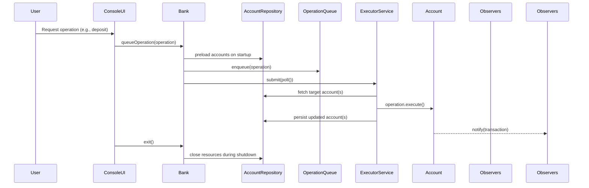
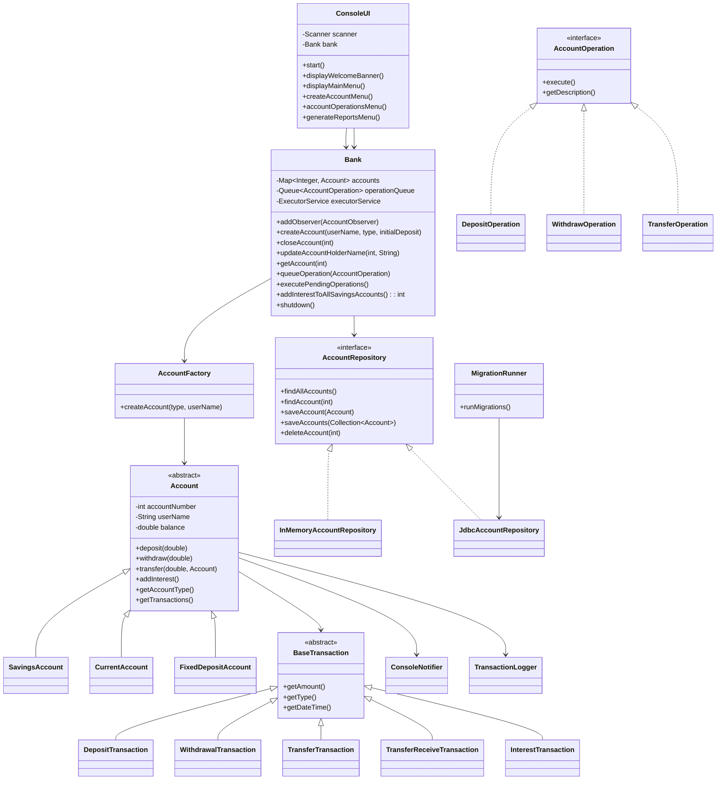

# Low-Level Architecture

This document describes how the Java modules collaborate within the Banking System application. It focuses on class responsibilities, control flow, and extensibility points used by operations teams and contributors.

## Module Interaction Summary
The runtime orchestrates user commands from the console through a set of cohesive modules:
- **ConsoleUI** collects input and maps it to `AccountOperation` commands before delegating to the bank.
- **Bank** owns the account registry and manages the asynchronous operation queue/executor as well as interest routines.
- **AccountFactory** creates concrete account types while encapsulating initialization rules.
- **Account** subclasses (`SavingsAccount`, `CurrentAccount`, `FixedDepositAccount`) enforce balance policies and interest behavior.
- **AccountRepository** abstracts persistence; the runtime ships with an in-memory variant for tests and a JDBC-backed implementation that serializes accounts into relational storage.
- **MigrationRunner** applies SQL migrations stored under `src/main/resources/db/migration` to bring relational schemas up to date before the service starts accepting work.
- **Observers** (`ConsoleNotifier`, `TransactionLogger`) subscribe to account events to provide feedback and audit trails.

## Class Design

## Execution Flow Details
1. `BankingApplication` loads optional configuration from `banking.properties`, applies overrides from environment variables/system properties, runs database migrations when JDBC persistence is enabled, and builds a `Bank` with the resolved `AccountRepository` implementation.
2. When the operator selects an action, `ConsoleUI` delegates to service methods such as `Bank.deposit`, `Bank.withdraw`, or `Bank.transfer`, which validate prerequisites and wrap the appropriate `AccountOperation`.
3. The service layer enqueues the operation via `queueOperation`, and `executePendingOperations()` submits work to the `ExecutorService`. Each operation acquires per-account locks, loads the latest account state from the repository, applies domain logic, and persists the updated aggregate via `AccountRepository.saveAccount(s)`.
4. Accounts broadcast the resulting transaction through the observer list. `ConsoleNotifier` prints feedback; `TransactionLogger` writes audit lines.
5. On exit, `ConsoleUI` invokes `bank.shutdown()` to await outstanding futures, tear down the executor, and close the repository.

## Persistence Schema & Migrations
Relational persistence stores serialized `Account` aggregates for durability while retaining the rich domain object graph. The Flyway-style migration catalog lives under `src/main/resources/db/migration` and is executed by `MigrationRunner` before the application constructs the `Bank` service. Each file follows the `V{version}__{description}.sql` naming convention and is applied once, with the applied versions tracked inside the database.

### Core Tables
- **`schema_version`** – created on demand by `MigrationRunner` to register executed migrations. Columns: `version` (primary key), `description`, and `installed_on` timestamp.
- **`accounts`** – defined in `V1__create_accounts.sql` with the following structure:
  - `account_number` (`INT` primary key) – business identifier used throughout the domain.
  - `account_type` (`VARCHAR`) – cached `Account.getAccountType()` string for quick filtering/debugging.
  - `account_holder` (`VARCHAR`) – snapshot of the customer name to support ad-hoc queries.
  - `creation_date` (`VARCHAR`) – original creation date captured by the aggregate.
  - `updated_at` (`TIMESTAMP`) – last persistence timestamp maintained by the repository.
  - `payload` (`BLOB`) – serialized Java object containing balances, transaction history, and type-specific metadata.

`JdbcAccountRepository` uses optimistic serialization: operations deserialize payloads when executing, rely on domain rules for validation, then write updated payloads back within a single JDBC transaction. Additional tables can be introduced by adding new migration scripts; `MigrationRunner` will detect and apply them automatically on startup.

## Extension Points
- **New account type:** Implement a subclass of `Account` and update `AccountFactory` to instantiate it.
- **Additional operations:** Add a new `AccountOperation` implementation and expose it in `ConsoleUI`.
- **Alternative persistence:** Implement `AccountRepository` to integrate with another datastore (e.g., document DB) or extend `JdbcAccountRepository` if additional tables are required. Register migrations alongside the existing `db/migration` scripts to maintain automated bootstrapping.
- **New observers:** Implement `AccountObserver` (see `ConsoleNotifier`) to tap into the event stream without touching business logic.