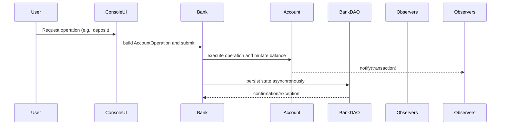
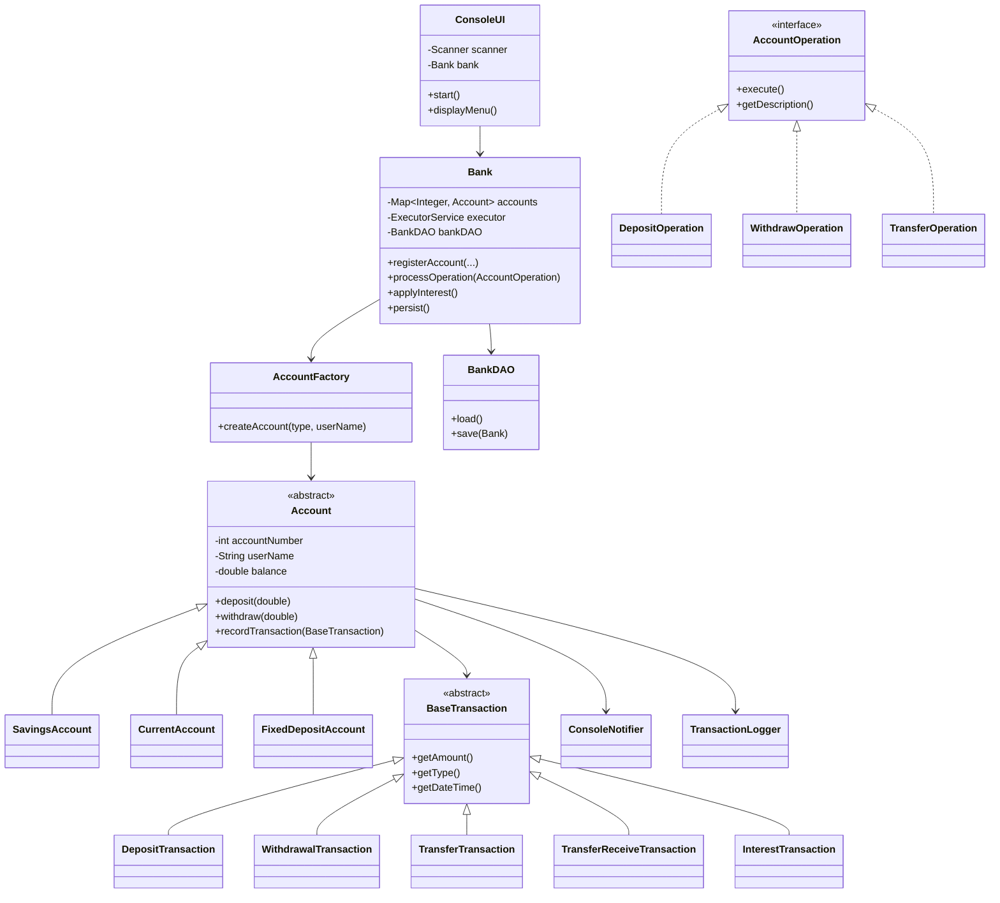

# Low-Level Architecture

This document describes how the Java modules collaborate within the Banking System application. It focuses on class responsibilities, control flow, and extensibility points used by operations teams and contributors.

## Module Interaction Summary
The runtime orchestrates user commands from the console through a set of cohesive modules:
- **ConsoleUI** collects input and maps it to `AccountOperation` commands.
- **Bank** owns the account registry, transaction executor, and persistence hooks.
- **AccountFactory** creates concrete account types while encapsulating initialization rules.
- **Account** subclasses (`SavingsAccount`, `CurrentAccount`, `FixedDepositAccount`) enforce balance policies and interest behavior.
- **BankDAO** persists and restores the `Bank` aggregate via Java serialization.
- **Observers** (`ConsoleNotifier`, `TransactionLogger`) subscribe to account events to provide feedback and audit trails.

## Class Design

## Execution Flow Details
1. `ConsoleUI` spins up and loads existing state via `BankDAO.load()`. If the serialized file is absent, a new `Bank` is constructed.
2. When the operator selects an action, `ConsoleUI` builds the appropriate `AccountOperation` (e.g., `DepositOperation`) and hands it to `Bank.processOperation`.
3. `Bank` submits the work to its `ExecutorService`. Operations mutate account state in a thread-safe manner and append concrete `BaseTransaction` entries.
4. Accounts broadcast the resulting transaction through the observer list. `ConsoleNotifier` prints feedback; `TransactionLogger` writes audit lines.
5. After each successful operation or on shutdown, `Bank.persist()` triggers `BankDAO.save(bank)`, updating `banking_system.ser`.

## Extension Points
- **New account type:** Implement a subclass of `Account` and update `AccountFactory` to instantiate it.
- **Additional operations:** Add a new `AccountOperation` implementation and expose it in `ConsoleUI`.
- **Alternative persistence:** Replace `BankDAO` with a repository using JDBC or an ORM; the `Bank` contract stays unchanged.
- **New observers:** Implement `AccountObserver` (see `ConsoleNotifier`) to tap into the event stream without touching business logic.
