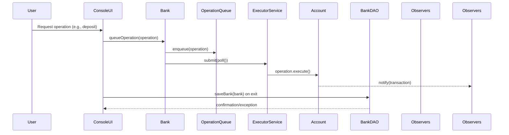
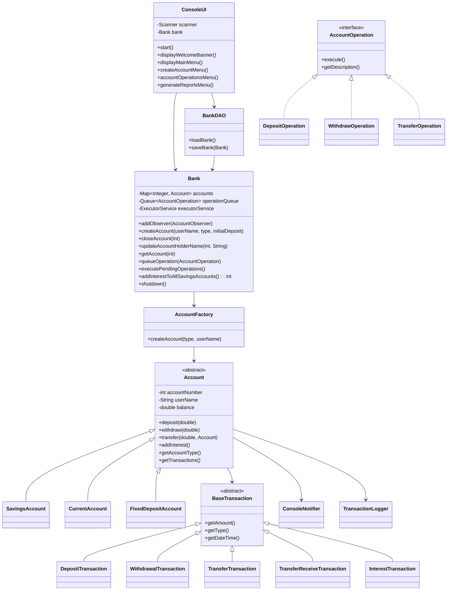

# Low-Level Architecture

This document describes how the Java modules collaborate within the Banking System application. It focuses on class responsibilities, control flow, and extensibility points used by operations teams and contributors.

## Module Interaction Summary
The runtime orchestrates user commands from the console through a set of cohesive modules:
- **ConsoleUI** collects input and maps it to `AccountOperation` commands before delegating to the bank.
- **Bank** owns the account registry and manages the asynchronous operation queue/executor as well as interest routines.
- **AccountFactory** creates concrete account types while encapsulating initialization rules.
- **Account** subclasses (`SavingsAccount`, `CurrentAccount`, `FixedDepositAccount`) enforce balance policies and interest behavior.
- **BankDAO** persists and restores the `Bank` aggregate via Java serialization.
- **Observers** (`ConsoleNotifier`, `TransactionLogger`) subscribe to account events to provide feedback and audit trails.

## Class Design

## Execution Flow Details
1. `BankingApplication` boots by calling `BankDAO.loadBank()`. `BankRepositoryFactory` resolves a repository implementation (MySQL via JDBC in production, snapshots for local testing) and hydrates the aggregate or creates a fresh `Bank` when no persisted state exists.
2. When the operator selects an action, `ConsoleUI` delegates to service methods such as `Bank.deposit`, `Bank.withdraw`, or `Bank.transfer`, which handle validation and wrap the appropriate `AccountOperation`.
3. The service layer enqueues the operation via `queueOperation`, and `executePendingOperations()` submits work to the `ExecutorService`. Operations mutate account state in a thread-safe manner and append concrete `BaseTransaction` entries.
4. Accounts broadcast the resulting transaction through the observer list. `ConsoleNotifier` prints feedback; `TransactionLogger` writes audit lines.
5. On exit, `ConsoleUI` invokes `bank.shutdown()` to await outstanding futures before `BankDAO.saveBank(bank)` streams the latest snapshot into the configured repository (MySQL tables in production, the filesystem snapshot when explicitly configured for local development).

## Reporting and Analytics
- The reporting subsystem now exposes both per-account statements and cross-portfolio analytics. Requests are described by `AnalyticsReportRequest`, which captures the KPI window (start/end dates), high-value anomaly threshold, and the rolling aggregation window (default seven days) used for trend smoothing.
- `AccountAnalyticsService` derives the following KPIs for every request:
  - Balance metrics (total, average, median) across all accounts.
  - Net inflow/outflow totals per window.
  - Daily net change trend points with a configurable rolling average window.
  - Account-level balance snapshots containing current balance and net movement during the period.
  - Anomaly flags for negative balances and transactions exceeding the configured threshold.
- Long-running analytics are executed asynchronously via `AnalyticsReportOperation`, which is queued through `Bank.queueOperation`. Callers receive a `CompletableFuture<AnalyticsReport>` that resolves when the executor completes the computation.
- Console and HTTP clients share the analytics pipeline:
  - `ReportFlow` prompts for optional start/end dates, anomaly threshold, and rolling window before requesting analytics. `AnalyticsPresenter` renders summaries and produces CSV/JSON exports for operators.
  - `BankHttpServer` exposes `/reports/analytics.json` and `/reports/analytics.csv` endpoints. Optional query parameters `start`, `end`, `threshold`, and `window` map to `AnalyticsReportRequest` fields.
- Aggregation defaults: if callers omit the time window the system evaluates the previous 30 days of activity, smoothing daily trends with a 7-day rolling average and flagging transactions ≥ 5000 monetary units.

## Extension Points
- **New account type:** Implement a subclass of `Account` and update `AccountFactory` to instantiate it.
- **Additional operations:** Add a new `AccountOperation` implementation and expose it in `ConsoleUI`.
- **Alternative persistence:** Swap the repository selection in `BankRepositoryFactory` if the deployment needs a different datastore (e.g., Postgres or a managed document database) while keeping the `Bank` contract unchanged.
- **New observers:** Implement `AccountObserver` (see `ConsoleNotifier`) to tap into the event stream without touching business logic.