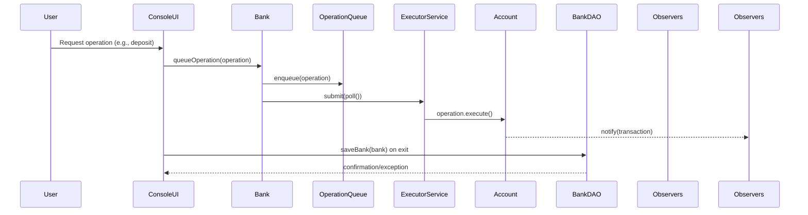
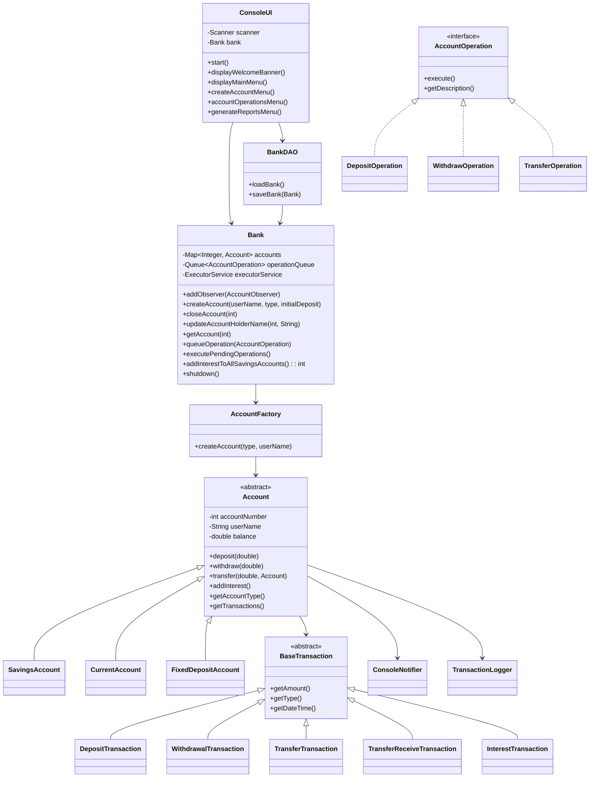

# Low-Level Architecture

This document describes how the Java modules collaborate within the Banking System application. It focuses on class responsibilities, control flow, and extensibility points used by operations teams and contributors.

## Module Interaction Summary
The runtime orchestrates user commands from the console through a set of cohesive modules:
- **ConsoleUI** collects input and maps it to `AccountOperation` commands before delegating to the bank.
- **Bank** owns the account registry and manages the asynchronous operation queue/executor as well as interest routines.
- **AccountFactory** creates concrete account types while encapsulating initialization rules.
- **Account** subclasses (`SavingsAccount`, `CurrentAccount`, `FixedDepositAccount`) enforce balance policies and interest behavior.
- **BankDAO** persists and restores the `Bank` aggregate via Java serialization.
- **Observers** (`ConsoleNotifier`, `TransactionLogger`) subscribe to account events to provide feedback and audit trails.

## Class Design

## Execution Flow Details
1. `BankingApplication` boots by calling `BankDAO.loadBank()`. If the serialized file is absent, a new `Bank` is constructed and passed into `ConsoleUI`.
2. When the operator selects an action, `ConsoleUI` delegates to service methods such as `Bank.deposit`, `Bank.withdraw`, or `Bank.transfer`, which handle validation and wrap the appropriate `AccountOperation`.
3. The service layer enqueues the operation via `queueOperation`, and `executePendingOperations()` submits work to the `ExecutorService`. Operations mutate account state in a thread-safe manner and append concrete `BaseTransaction` entries.
4. Accounts broadcast the resulting transaction through the observer list. `ConsoleNotifier` prints feedback; `TransactionLogger` writes audit lines.
5. On exit, `ConsoleUI` invokes `bank.shutdown()` to await outstanding futures before `BankDAO.saveBank(bank)` updates `banking_system.ser` with the latest serialized snapshot.

## Reporting & Analytics Enhancements
- **Analytics Pipeline:** `TrendAnalyticsService`, `AnomalyDetectionService`, and `RangeAnalyticsService` (see `banking/report/analytics`) compute KPI-centric views over transaction history. They share an `AnalyticsRange` value object to guarantee consistent date validation.
- **Async Workloads:** `AnalyticsReportService` queues long-running analytics jobs through `Bank.submitAnalyticsTask`, reusing the existing executor and observer notifications so report generation does not block foreground operations.
- **Formatting Layer:** `ReportFormatter` (`banking/report/format`) renders analytics outputs as JSON or CSV, ensuring CLI and HTTP clients can choose the representation that best fits downstream tooling.
- **Operator Access:** `ReportFlow` now offers trend, anomaly, and KPI range reports, prompting for date windows and output formats while streaming CSV/JSON back to the console.
- **API Exposure:** `BankHttpServer` exposes `/reports/trends`, `/reports/anomalies`, and `/reports/range` endpoints. Each accepts `start`, `end`, optional tuning parameters, and a `format` selector to return the chosen representation.

## Extension Points
- **New account type:** Implement a subclass of `Account` and update `AccountFactory` to instantiate it.
- **Additional operations:** Add a new `AccountOperation` implementation and expose it in `ConsoleUI`.
- **Alternative persistence:** Replace `BankDAO` with a repository using JDBC or an ORM; the `Bank` contract stays unchanged.
- **New observers:** Implement `AccountObserver` (see `ConsoleNotifier`) to tap into the event stream without touching business logic.