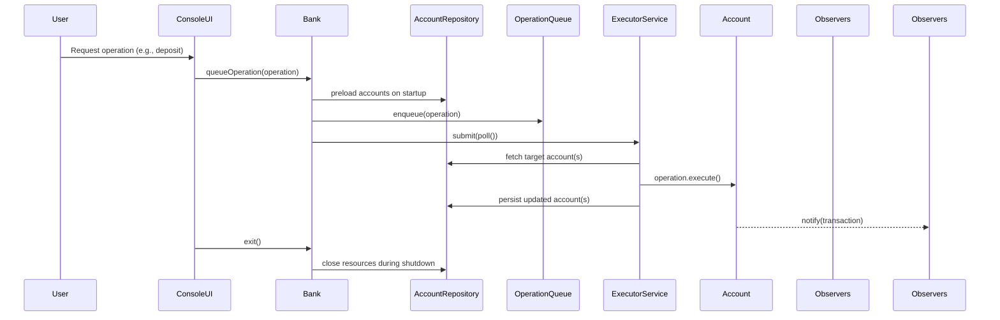

# Low-Level Architecture

This document describes how the Java modules collaborate within the Banking System application. It focuses on class responsibilities, control flow, and extensibility points used by operations teams and contributors.

## Module Interaction Summary
The runtime orchestrates user commands from the console through a set of cohesive modules:
- **ConsoleUI** collects input and maps it to `AccountOperation` commands before delegating to the bank.
- **Bank** owns the account registry and manages the asynchronous operation queue/executor as well as interest routines.
- **AccountFactory** creates concrete account types while encapsulating initialization rules.
- **Account** subclasses (`SavingsAccount`, `CurrentAccount`, `FixedDepositAccount`) enforce balance policies and interest behavior.
- **AccountRepository** abstracts persistence; the runtime ships with an in-memory variant for tests and a JDBC-backed implementation that serializes accounts into relational storage.
- **MigrationRunner** applies SQL migrations stored under `src/main/resources/db/migration` to bring relational schemas up to date before the service starts accepting work.
- **Observers** (`ConsoleNotifier`, `TransactionLogger`) subscribe to account events to provide feedback and audit trails.

## Class Design

## Execution Flow Details
1. `BankingApplication` boots by calling `BankDAO.loadBank()`. `BankRepositoryFactory` resolves a repository implementation (MySQL via JDBC in production, snapshots for local testing) and hydrates the aggregate or creates a fresh `Bank` when no persisted state exists.
2. When the operator selects an action, `ConsoleUI` delegates to service methods such as `Bank.deposit`, `Bank.withdraw`, or `Bank.transfer`, which handle validation and wrap the appropriate `AccountOperation`.
3. The service layer enqueues the operation via `queueOperation`, and `executePendingOperations()` submits work to the `ExecutorService`. Operations mutate account state in a thread-safe manner and append concrete `BaseTransaction` entries.
4. Accounts broadcast the resulting transaction through the observer list. `ConsoleNotifier` prints feedback; `TransactionLogger` writes audit lines.
5. On exit, `ConsoleUI` invokes `bank.shutdown()` to await outstanding futures before `BankDAO.saveBank(bank)` streams the latest snapshot into the configured repository (MySQL tables in production, the filesystem snapshot when explicitly configured for local development).

## Reporting and Analytics
- The reporting subsystem now exposes both per-account statements and cross-portfolio analytics. Requests are described by `AnalyticsReportRequest`, which captures the KPI window (start/end dates), high-value anomaly threshold, and the rolling aggregation window (default seven days) used for trend smoothing.
- `AccountAnalyticsService` derives the following KPIs for every request:
  - Balance metrics (total, average, median) across all accounts.
  - Net inflow/outflow totals per window.
  - Daily net change trend points with a configurable rolling average window.
  - Account-level balance snapshots containing current balance and net movement during the period.
  - Anomaly flags for negative balances and transactions exceeding the configured threshold.
- Long-running analytics are executed asynchronously via `AnalyticsReportOperation`, which is queued through `Bank.queueOperation`. Callers receive a `CompletableFuture<AnalyticsReport>` that resolves when the executor completes the computation.
- Console and HTTP clients share the analytics pipeline:
  - `ReportFlow` prompts for optional start/end dates, anomaly threshold, and rolling window before requesting analytics. `AnalyticsPresenter` renders summaries and produces CSV/JSON exports for operators.
  - `BankHttpServer` exposes `/reports/analytics.json` and `/reports/analytics.csv` endpoints. Optional query parameters `start`, `end`, `threshold`, and `window` map to `AnalyticsReportRequest` fields.
- Aggregation defaults: if callers omit the time window the system evaluates the previous 30 days of activity, smoothing daily trends with a 7-day rolling average and flagging transactions ≥ 5000 monetary units.

## Reporting & Analytics Enhancements
- **Analytics Pipeline:** `TrendAnalyticsService`, `AnomalyDetectionService`, and `RangeAnalyticsService` (see `banking/report/analytics`) compute KPI-centric views over transaction history. They share an `AnalyticsRange` value object to guarantee consistent date validation.
- **Async Workloads:** `AnalyticsReportService` queues long-running analytics jobs through `Bank.submitAnalyticsTask`, reusing the existing executor and observer notifications so report generation does not block foreground operations.
- **Formatting Layer:** `ReportFormatter` (`banking/report/format`) renders analytics outputs as JSON or CSV, ensuring CLI and HTTP clients can choose the representation that best fits downstream tooling.
- **Operator Access:** `ReportFlow` now offers trend, anomaly, and KPI range reports, prompting for date windows and output formats while streaming CSV/JSON back to the console.
- **API Exposure:** `BankHttpServer` exposes `/reports/trends`, `/reports/anomalies`, and `/reports/range` endpoints. Each accepts `start`, `end`, optional tuning parameters, and a `format` selector to return the chosen representation.

## Persistence Schema & Migrations
Relational persistence stores serialized `Account` aggregates for durability while retaining the rich domain object graph. The Flyway-style migration catalog lives under `src/main/resources/db/migration` and is executed by `MigrationRunner` before the application constructs the `Bank` service. Each file follows the `V{version}__{description}.sql` naming convention and is applied once, with the applied versions tracked inside the database.

### Core Tables
- **`schema_version`** – created on demand by `MigrationRunner` to register executed migrations. Columns: `version` (primary key), `description`, and `installed_on` timestamp.
- **`accounts`** – defined in `V1__create_accounts.sql` with the following structure:
  - `account_number` (`INT` primary key) – business identifier used throughout the domain.
  - `account_type` (`VARCHAR`) – cached `Account.getAccountType()` string for quick filtering/debugging.
  - `account_holder` (`VARCHAR`) – snapshot of the customer name to support ad-hoc queries.
  - `creation_date` (`VARCHAR`) – original creation date captured by the aggregate.
  - `updated_at` (`TIMESTAMP`) – last persistence timestamp maintained by the repository.
  - `payload` (`BLOB`) – serialized Java object containing balances, transaction history, and type-specific metadata.

`JdbcAccountRepository` uses optimistic serialization: operations deserialize payloads when executing, rely on domain rules for validation, then write updated payloads back within a single JDBC transaction. Additional tables can be introduced by adding new migration scripts; `MigrationRunner` will detect and apply them automatically on startup.

### Cache Subsystem
- **Abstraction:** `banking.cache.CacheProvider<K,V>` defines `get`, `put`, and invalidation primitives. The default `InMemoryCacheProvider` wraps a thread-safe map with TTL handling so cached accounts and balances expire predictably.
- **Configuration:** `CacheProviderFactory` inspects `CACHE_PROVIDER` / `banking.cache.provider` to decide between the in-memory provider and `NoOpCacheProvider`. TTL defaults to five minutes but can be overridden globally (`CACHE_TTL_SECONDS`) or per cache (`CACHE_ACCOUNT_TTL_SECONDS`, `CACHE_BALANCE_TTL_SECONDS`). Non-positive TTLs disable expiry.
- **Integration:** `Bank` seeds the cache during startup, repopulates entries on reads, and evicts them on account closure. Mutating operations (`DepositOperation`, `WithdrawOperation`, `TransferOperation`, interest accrual) refresh both the account and balance caches after persistence succeeds.

## Extension Points
- **New account type:** Implement a subclass of `Account` and update `AccountFactory` to instantiate it.
- **Additional operations:** Add a new `AccountOperation` implementation and expose it in `ConsoleUI`.
- **Alternative persistence:** Swap the repository selection in `BankRepositoryFactory` if the deployment needs a different datastore (e.g., Postgres or a managed document database) while keeping the `Bank` contract unchanged.
- **New observers:** Implement `AccountObserver` (see `ConsoleNotifier`) to tap into the event stream without touching business logic.