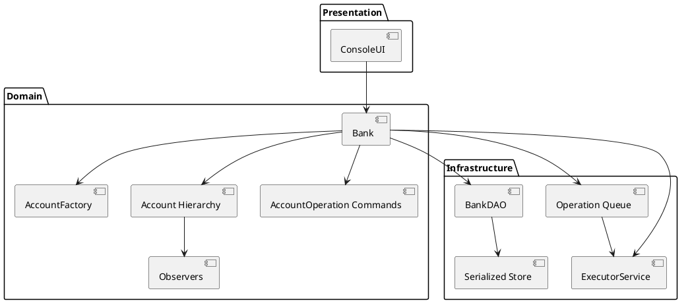
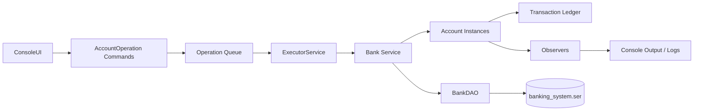

# System Design Overview

This guide captures the macro-architecture of the Banking System, focusing on deployment, data flow, and strategies for scaling the console experience into larger environments.

## Context & Goals
- Provide an operator-focused interface for managing customer accounts and transactions.
- Preserve durability of financial records while keeping the system simple enough for educational and demo purposes.
- Offer a foundation that can evolve into a multi-channel banking service.

## Logical Architecture
At runtime the application behaves as a monolithic service composed of presentation, domain, and infrastructure layers. The current packaging is a console executable, but the same layers can be exposed through alternative adapters (REST, messaging).

## Data Flow
1. Operators initiate actions from the CLI. Inputs are validated and mapped to command objects.
2. Commands are enqueued via `Bank.queueOperation` and drained through the `ExecutorService`, keeping the console responsive while operations run asynchronously against the target `Account` instances.
3. Each mutation appends a `BaseTransaction` record, enabling audit trails and replay.
4. Persistence writes the mutated bank aggregate to `banking_system.ser`. Startup reads the file back into memory.
5. Observers emit feedback to the console and structured logs for operators.

## Scalability Considerations
- **Thread Pool Sizing:** The executor currently uses a fixed thread pool. Increase the pool or migrate to a work-stealing pool when adding high-volume batch jobs.
- **External Storage:** Replace serialization with a transactional database (PostgreSQL, MySQL) to support concurrent clients and reporting workloads.
- **Service Interfaces:** Wrap the domain layer in REST or gRPC endpoints to support distributed user interfaces and automation.
- **Horizontal Scale:** Once stateless adapters exist, run multiple instances behind a load balancer and rely on the shared database for consistency.

## Infrastructure & Deployment
- **Local:** Java CLI application executed on developer machines. Source-controlled `banking_system.ser` should be excluded from commits to prevent leaking data.
- **Staging/Production Concept:** Package the application as a runnable JAR. Deploy to a container or VM with scheduled backups of the persistence file or database.
- **Observability:** Extend `TransactionLogger` to integrate with structured logging frameworks (e.g., Logback). Capture metrics for operation latency and failure counts.
- **Security:** Introduce secrets management for future database credentials and enforce TLS when exposing remote APIs.

## Security Requirements
- **Strong operator authentication:** Console and API operators must authenticate with salted password hashes stored outside of source control. Only unique, role-bound accounts are permitted.
- **Token-based API access:** REST endpoints require short-lived bearer tokens carrying explicit role assignments. Tokens must be revocable without restarting the service.
- **Least privilege authorization:** Roles map to fine-grained permissions (account creation, balance queries, funds movement, health checks). Endpoints verify both authentication and the relevant permission before executing.
- **Secure credential handling:** Passwords are never logged or stored in plaintext. Hashing uses per-user salts and modern digest algorithms. Token storage purges expired entries eagerly to limit attack windows.
- **Operational safety:** Administrative tooling must expose the ability to enumerate and revoke active tokens before shutdown. Shutdown flows automatically stop the HTTP listener to avoid orphaned services.

## Threat Model
- **Assets:** Customer account data, transaction history, operator credentials, issued access tokens, and the serialized persistence store.
- **Adversaries:**
  - External attackers attempting to call HTTP endpoints without credentials or with stolen/forged tokens.
  - Insider operators with limited roles attempting to escalate privileges or reuse old tokens.
  - Network eavesdroppers seeking to replay captured credentials or tokens.
- **Attack Surfaces & Mitigations:**
  - *HTTP interface:* Bearer-token middleware rejects missing or invalid tokens (401) and enforces per-endpoint permissions (403) to prevent privilege escalation.
  - *Credential store:* Salted hashes combined with credential bootstrap outside of the repository mitigate offline cracking and accidental disclosure.
  - *Token lifecycle:* Short expirations, manual revocation, and automatic purge reduce replay windows. Shutdown routines stop the server, invalidating active connections.
  - *Console tooling:* Login prompts and explicit operator flows ensure only authenticated staff can launch or administer the API. Tokens are displayed once and auditable through the management menu.
- **Assumptions & Future Hardening:** Transport security (TLS) and secret distribution are out of scope for the current CLI deployment. When deploying remotely, terminate TLS at the load balancer or service host, integrate with an HSM or secret manager, and enable auditing/alerting on repeated authentication failures.

## Disaster Recovery
- Store serialized snapshots (or database backups) offsite.
- Validate backups by performing periodic restore drills in a staging environment.
- Automate log shipping to aid in reconstructing transaction sequences during investigations.