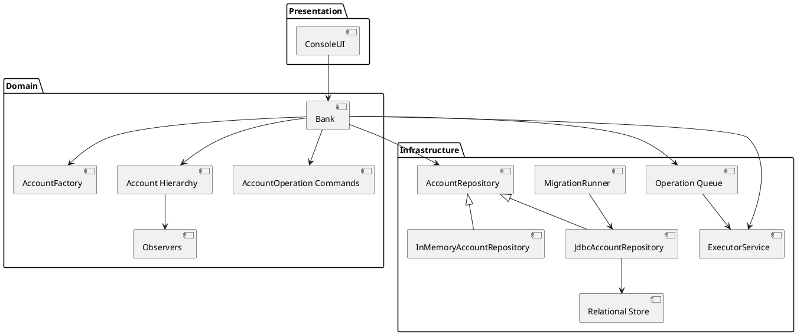
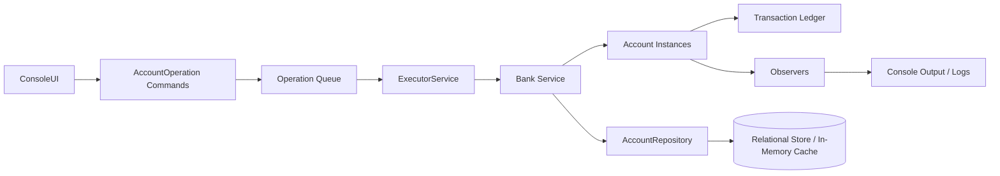

# System Design Overview

This guide captures the macro-architecture of the Banking System, focusing on deployment, data flow, and strategies for scaling the console experience into larger environments.

## Context & Goals
- Provide an operator-focused interface for managing customer accounts and transactions.
- Preserve durability of financial records while keeping the system simple enough for educational and demo purposes.
- Offer a foundation that can evolve into a multi-channel banking service.

## Logical Architecture
At runtime the application behaves as a monolithic service composed of presentation, domain, and infrastructure layers. The current packaging is a console executable, but the same layers can be exposed through alternative adapters (REST, messaging).

## Data Flow
1. Operators initiate actions from the CLI. Inputs are validated and mapped to command objects.
2. Commands are enqueued via `Bank.queueOperation` and drained through the `ExecutorService`, keeping the console responsive while operations run asynchronously against the target `Account` instances.
3. Each mutation appends a `BaseTransaction` record, enabling audit trails and replay.
4. Persistence serializes each mutated account to the configured `AccountRepository`. The JDBC implementation writes blobs into the `accounts` table while the in-memory variant simply keeps copies for fast tests.
5. Observers emit feedback to the console and structured logs for operators.

## Scalability Considerations
- **Thread Pool Sizing:** The executor currently uses a fixed thread pool. Increase the pool or migrate to a work-stealing pool when adding high-volume batch jobs.
- **External Storage:** Enable the JDBC repository with a managed database (PostgreSQL, MySQL, H2 for demos) to support concurrent clients and reporting workloads. Additional tables and migrations can be layered on incrementally.
- **Service Interfaces:** Wrap the domain layer in REST or gRPC endpoints to support distributed user interfaces and automation.
- **Horizontal Scale:** Once stateless adapters exist, run multiple instances behind a load balancer and rely on the shared database for consistency.

## Infrastructure & Deployment
- **Local:** Java CLI application executed on developer machines. Default configuration uses the in-memory repository; set `banking.persistence=jdbc` with an H2 URL to exercise the migration and JDBC code paths.
- **Staging/Production Concept:** Package the application as a runnable JAR. Deploy to a container or VM with scheduled backups of the relational database. Ship migration scripts alongside the artifact so environments bootstrap automatically.
- **Observability:** Extend `TransactionLogger` to integrate with structured logging frameworks (e.g., Logback). Capture metrics for operation latency and failure counts.
- **Security:** Introduce secrets management for future database credentials and enforce TLS when exposing remote APIs.

## Disaster Recovery
- Store database backups (or in-memory snapshots during development) offsite.
- Validate backups by performing periodic restore drills in a staging environment.
- Automate log shipping to aid in reconstructing transaction sequences during investigations.