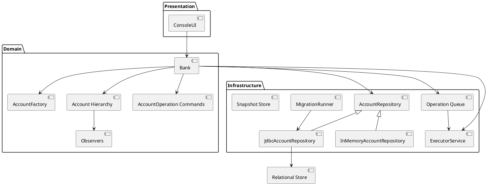

# System Design Overview

This guide captures the macro-architecture of the Banking System, focusing on deployment, data flow, and strategies for scaling the console experience into larger environments.

## Context & Goals
- Provide an operator-focused interface for managing customer accounts and transactions.
- Preserve durability of financial records while keeping the system simple enough for educational and demo purposes.
- Offer a foundation that can evolve into a multi-channel banking service.

## Logical Architecture
At runtime the application behaves as a monolithic service composed of presentation, domain, and infrastructure layers. The current packaging is a console executable, but the same layers can be exposed through alternative adapters (REST, messaging).

## Data Flow
1. Operators initiate actions from the CLI. Inputs are validated and mapped to command objects.
2. Commands are enqueued via `Bank.queueOperation` and drained through the `ExecutorService`, keeping the console responsive while operations run asynchronously against the target `Account` instances.
3. Each mutation appends a `BaseTransaction` record, enabling audit trails and replay.
4. Persistence writes the mutated bank aggregate to `banking_state.properties`. Startup reads the snapshot back into memory.
5. Observers emit feedback to the console and structured logs for operators.

## Scalability Considerations
- **Thread Pool Sizing:** The executor currently uses a fixed thread pool. Increase the pool or migrate to a work-stealing pool when adding high-volume batch jobs.
- **External Storage:** Enable the JDBC repository with a managed database (PostgreSQL, MySQL, H2 for demos) to support concurrent clients and reporting workloads. Additional tables and migrations can be layered on incrementally.
- **Service Interfaces:** Wrap the domain layer in REST or gRPC endpoints to support distributed user interfaces and automation.
- **Horizontal Scale:** Once stateless adapters exist, run multiple instances behind a load balancer and rely on the shared database for consistency.

## Infrastructure & Deployment
- **Local:** Developers default to Docker Compose, which provisions MySQL alongside the console/API containers for parity with staging. Snapshot mode is still available for isolated experiments but should not be committed to source control.
- **Staging/Production Concept:** Package the application as a runnable JAR. Deploy to Kubernetes or VMs with managed MySQL instances, scheduled logical backups, and secrets-driven configuration.

- **Observability:** Extend `TransactionLogger` to integrate with structured logging frameworks (e.g., Logback). Capture metrics for operation latency and failure counts.
- **Security:** Introduce secrets management for future database credentials and enforce TLS when exposing remote APIs.

### Deployment Topologies
- **Developer Workstation:** Run the console or API directly from source while pointing `BANKING_JDBC_URL` at Docker Compose’s MySQL instance. This mirrors production behavior while remaining easy to reset.
- **Containerized Console:** Package the CLI runner into a container and execute it as a one-shot job (e.g., Kubernetes CronJob) for batch or operational tasks. Database credentials are injected via Kubernetes secrets so the job shares the live relational store.
- **API Service:** Run the hardened `ApiApplication` (backed by the consolidated `BankHttpServer`) behind an ingress/load balancer. Multiple replicas share the managed MySQL cluster, enforce API-key authentication, and expose Prometheus-friendly metrics for traffic shaping.
- **Hybrid:** Combine the API deployment with a console maintenance job for operational scenarios. Both workloads connect to the same database credentials rather than relying on a shared filesystem.
- **Active/Active:** Deploy API replicas in two regions backed by a cross-region MySQL topology (e.g., Amazon Aurora or Cloud SQL with read replicas). Replicate application logs and metrics to both regions for resiliency.

### Service Level Indicators & Objectives
The platform tracks user-centric SLIs that map to explicit SLO targets for the console and API personas.

| Capability | SLI | Target SLO | Notes |
| --- | --- | --- | --- |
| API Health | Percentage of `/healthz` probes returning 200 | ≥ 99.5% per 30-day window | Alerts page primary on sustained dips below target. |
| API Metrics Freshness | Successful scrapes of `/metrics` endpoint | ≥ 99% | Ensures autoscalers and dashboards reflect queue pressure and uptime. |
| API Latency | 95th percentile response time for `/accounts` | ≤ 300 ms during business hours | Measured via synthetic probes hitting the load balancer. |
| Console Job Success | Percentage of scheduled console jobs exiting with code 0 | ≥ 99% monthly | Retries can be orchestrated by Kubernetes CronJobs. |
| Data Durability | Backup success rate for serialized store or DB snapshots | 100% of scheduled backups | Failing backups block production changes. |
| Deployment Quality | Post-deploy smoke test pass rate | 100% | Gate production promotion on automated verification. |

### HTTP API Surface
Automation clients and staging smoke tests interact with the unified HTTP adapter using the following resources:

| Endpoint | Method(s) | Description |
| --- | --- | --- |
| `/health`, `/healthz` | GET | Liveness/readiness probes returning uptime telemetry. |
| `/metrics` | GET | Prometheus-formatted counters for uptime, account counts, and pending work. Requires `X-API-Key`. |
| `/accounts` | GET, POST | Enumerate accounts with filtering helpers or open new accounts with optional initial deposits. Requires `X-API-Key`. |
| `/accounts/{accountNumber}` | GET, PUT, DELETE | Retrieve specific accounts, update account holder names, or close accounts with deterministic responses. Requires `X-API-Key`. |
| `/operations/deposit` | POST | Queue a deposit for asynchronous processing. Requires `X-API-Key`. |
| `/operations/withdraw` | POST | Queue a withdrawal with validation feedback. Requires `X-API-Key`. |
| `/operations/transfer` | POST | Atomically move funds between accounts with conflict handling. Requires `X-API-Key`. |
## Security Requirements
- **Strong operator authentication:** Console and API operators must authenticate with salted password hashes stored outside of source control. Only unique, role-bound accounts are permitted.
- **Token-based API access:** REST endpoints require short-lived bearer tokens carrying explicit role assignments. Tokens must be revocable without restarting the service.
- **Least privilege authorization:** Roles map to fine-grained permissions (account creation, balance queries, funds movement, health checks). Endpoints verify both authentication and the relevant permission before executing.
- **Secure credential handling:** Passwords are never logged or stored in plaintext. Hashing uses per-user salts and modern digest algorithms. Token storage purges expired entries eagerly to limit attack windows.
- **Operational safety:** Administrative tooling must expose the ability to enumerate and revoke active tokens before shutdown. Shutdown flows automatically stop the HTTP listener to avoid orphaned services.

## Threat Model
- **Assets:** Customer account data, transaction history, operator credentials, issued access tokens, and the serialized persistence store.
- **Adversaries:**
  - External attackers attempting to call HTTP endpoints without credentials or with stolen/forged tokens.
  - Insider operators with limited roles attempting to escalate privileges or reuse old tokens.
  - Network eavesdroppers seeking to replay captured credentials or tokens.
- **Attack Surfaces & Mitigations:**
  - *HTTP interface:* Bearer-token middleware rejects missing or invalid tokens (401) and enforces per-endpoint permissions (403) to prevent privilege escalation.
  - *Credential store:* Salted hashes combined with credential bootstrap outside of the repository mitigate offline cracking and accidental disclosure.
  - *Token lifecycle:* Short expirations, manual revocation, and automatic purge reduce replay windows. Shutdown routines stop the server, invalidating active connections.
  - *Console tooling:* Login prompts and explicit operator flows ensure only authenticated staff can launch or administer the API. Tokens are displayed once and auditable through the management menu.
- **Assumptions & Future Hardening:** Transport security (TLS) and secret distribution are out of scope for the current CLI deployment. When deploying remotely, terminate TLS at the load balancer or service host, integrate with an HSM or secret manager, and enable auditing/alerting on repeated authentication failures.

## Disaster Recovery
- Store database backups (or in-memory snapshots during development) offsite.
- Validate backups by performing periodic restore drills in a staging environment.
- Automate log shipping to aid in reconstructing transaction sequences during investigations.

### State Management & Migrations
- Relational storage is handled through the JDBC repository. On boot the `BankRepositoryFactory` wires a `DriverManagerDataSource`, executes deterministic schema migrations, and exposes a repository that maps accounts and transactions into normalized tables.
- `deploy/scripts/run-migrations.sh` invokes `banking.persistence.repository.DatabaseMigrationCli`, ensuring Kubernetes jobs, Terraform pipelines, or GitHub Actions runners can upgrade the schema ahead of traffic shifts. Migrations are versioned in the `bank_schema_migrations` table and run transactionally for idempotency.
- Local developers can switch back to the filesystem-backed snapshot repository by unsetting `BANKING_STORAGE_MODE`. Legacy `.ser` files are read on first boot and persisted into the relational schema to maintain backwards compatibility.
